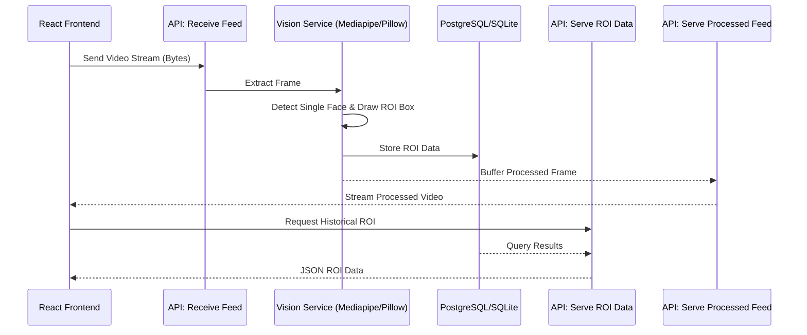

# BlazeFace Streaming Engine

> **A high-performance, real-time face detection streaming platform built with zero OpenCV dependencies.**

[](https://fastapi.tiangolo.com/)
[](https://reactjs.org/)
[](https://vitejs.dev/)
[](https://www.docker.com/)

FaceStream is a highly optimized full-stack application that provides real-time Face Detection telemetry. It bypasses the traditional heavyweight OpenCV stack, instead opting for a lightning-fast combination of **FastAPI**, **MediaPipe (BlazeFace)**, and a **React/Vite Bento UI**. This repository was engineered for high throughput, sub-100ms latency on commodity CPUs, and strict edge-deployment compatibility.

---

## Live Demos
- **Frontend (Vercel):** [https://blazeface-streaming-engine.vercel.app](https://blazeface-streaming-engine.vercel.app) *(Placeholder: Update after deployment)*
- **Backend API (Render):** [https://blazeface-streaming-engine.onrender.com](https://blazeface-streaming-engine.onrender.com) *(Placeholder: Update after deployment)*

---

## Table of Contents
1. [Core Features](#-core-features)
2. [System Architecture](#-system-architecture)
3. [Manual Setup & Installation](#-manual-setup--installation)
4. [Deployment (Split Architecture)](#-deployment-split-architecture)
5. [License](#-license)

---

## Core Features
* **Zero OpenCV Usage**: Replaces heavy `cv2` pipelines with pure MediaPipe inference and Pillow-based annotation, drastically reducing the container footprint and memory usage.
* **MJPEG Streaming Loop**: An asynchronous FastAPI backend maintains a persistent stream, extracting Region of Interest (ROI) bounding boxes continuously at 15+ FPS on standard CPU hardware.
* **SOC Dashboard**: A royal, glassmorphism-inspired React dashboard featuring live telemetry, SVG confidence gauges, and structural event logging.
* **Hardened Pipeline**: Includes strict payload limits (2MB max per frame), rate limiting, and CORS security out of the box.

---

## System Architecture

The architecture explicitly separates the ingestion layer, the inference layer, and the rendering layer.

### 1. Clean Separation of Concerns


### 2. API Design & Contracts
API Design & Contracts adhere strictly to HTTP semantics:
- **Endpoint 1 (Receive Feed):** `POST /api/v1/feed/ingest`
- **Endpoint 2 (Serve Feed):** `GET /api/v1/feed/stream`
- **Endpoint 3 (Serve ROI Data):** `GET /api/v1/roi`

### 3. Vision Processing Layer
The vision processing layer explicitly uses **Mediapipe BlazeFace** for CPU-efficient detection and **Pillow** for non-OpenCV drawing.
- **Edge Case Handling:**
  - **No face detected:** Return original frame, skip DB insert.
  - **Multiple faces:** Algorithm strictly isolates the first/largest face detected.
  - **Corrupt frame:** Catch image parsing errors, drop frame, log warning, do not crash server.

### 4. Threat Model & Security Fundamentals
| Attack Vector | Control | Layer |
| :--- | :--- | :--- |
| **Malicious Image Buffer** | MIME-type validation + Buffer limit | Backend Middleware |
| **SQL Injection** | SQLAlchemy ORM parameterized queries | Data Layer |
| **WS Resource Exhaustion** | Rate limiting / Per-Session connection limits | FastAPI |
| **XSS** | React component-based rendering (auto-escape) | Frontend |

---

## Manual Setup & Installation

Want to run the SOC monitor locally without Docker? Follow these manual setup steps.

### Prerequisites
- Node.js (v18+)
- Python (3.10+)

### 1. Backend Setup
```bash
# Navigate to backend directory
cd backend

# Create and activate virtual environment
python -m venv venv
source venv/bin/activate  # On Windows: venv\Scripts\activate

# Install dependencies
pip install -r requirements.txt

# Start the FastAPI server
uvicorn main:app --reload --port 8888
```
*The API will be available at `http://localhost:8888` and Swagger docs at `http://localhost:8888/docs`.*

### 2. Frontend Setup
Open a new terminal window:
```bash
# Navigate to frontend directory
cd frontend

# Install Node dependencies
npm install

# Start the Vite development server
npm run dev
```
*The Dashboard will be available at `http://localhost:5173`.*

---

## Deployment (Split Architecture)

FaceStream is designed for a split-deployment model to ensure the streaming backend isn't killed by serverless timeouts.

### 1. Frontend (Vercel)
The React/Vite dashboard is completely statically generated and optimized for Vercel.
1. Connect this GitHub repository to Vercel.
2. Set the **Root Directory** to `frontend`.
3. Add the Environment Variable: `VITE_API_URL=<YOUR_BACKEND_URL>`.
4. Deploy. (Routing is automatically handled by the included `vercel.json`).

### 2. Backend (Render / Railway / Fly.io)
The FastAPI backend requires persistent infrastructure to keep the MJPEG WebSocket/Streaming connections alive.
1. Connect this GitHub repository to Render.
2. Render will automatically detect the included `render.yaml` blueprint.
3. The system will deploy the backend (port 8888) with zero manual configuration.

---

## License
MIT
